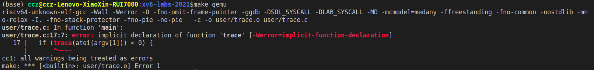
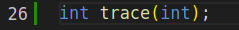
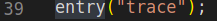
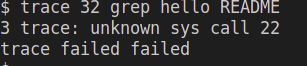

# MIT6.s081

## OS organization and system calls 

**preparation**:

阅读 [chapter2](doc/Chapter2.md)，xv6 code: [kernel/proc.h](xv6-labs-2021/kernel/proc.h), [kernel/defs.h](xv6-labs-2021/kernel/defs.h), [kernel/entry.S](xv6-labs-2021/kernel/entry.S), [kernel/main.c](xv6-labs-2021/kernel/main.c), [user/initcode.S](xv6-labs-2021/user/initcode.S), [user/init.c](xv6-labs-2021/user/init.c), and skim [kernel/proc.c](xv6-labs-2021/kernel/proc.c) and [kernel/exec.c](xv6-labs-2021/kernel/exec.c)

Before you start coding, read Chapter 2 of the xv6 book, and Sections 4.3 and 4.4 of Chapter 4, and related source files:

- The user-space code for systems calls is in user/user.h and user/usys.pl.
- The kernel-space code is kernel/syscall.h, kernel/syscall.c.
- The process-related code is kernel/proc.h and kernel/proc.c.

## System call tracing

>In this assignment you will add a system call tracing feature that may help you when debugging later labs. You'll create a new trace system call that will control tracing. It should take one argument, an integer "mask", whose bits specify which system calls to trace. For example, to trace the fork system call, a program calls trace(1 << SYS_fork), where SYS_fork is a syscall number from kernel/syscall.h. You have to modify the xv6 kernel to print out a line when each system call is about to return, if the system call's number is set in the mask. The line should contain the process id, the name of the system call and the return value; you don't need to print the system call arguments. The trace system call should enable tracing for the process that calls it and any children that it subsequently forks, but should not affect other processes.

1. 添加 _trace 编译选项

`Makefile` 文件 196 行添加 `$U/_trace\`，执行 `make qemu`

user/trace.c 报错，因为还没有 trace 系统调用（system call）

在user/user.h 添加 trace 的前置声明

在user/usys.pl 添加 trace，usys.pl 用于生成 usys.S 代码

在 kernel/syscall.h 添加 trace 的系统调用号码，用于 usys.S 进行实际调用。

完成后执行`make qemu`即可完成编译，但是由于实际的trace还未完成，所以当使用trace时，会发生错误。

