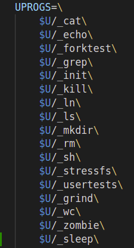
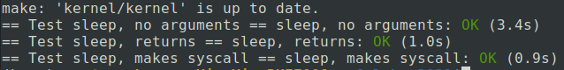
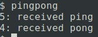
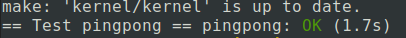
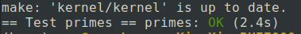
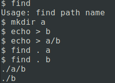
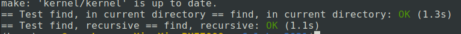

# Lab: Xv6 and Unix utilities

## 准备工具

[lab tools](https://pdos.csail.mit.edu/6.828/2021/tools.html)

环境：Ubuntu20.04

```bash
sudo apt-get install git build-essential gdb-multiarch qemu-system-misc gcc-riscv64-linux-gnu binutils-riscv64-linux-gnu

```

Fetch the xv6 source for the lab and check out the util branch:

```bash
git clone git://g.csail.mit.edu/xv6-labs-2021
cd xv6-labs-2021
git checkout util
```

Build and run xv6:

```bash
make qemu
```

`Ctrl+p` 查看进程
`Ctrl+a x` 退出qemu

## Grading and hand-in procedure

### Sleep

>Implement the UNIX program sleep for xv6; your sleep should pause for a user-specified number of ticks. A tick is a notion of time defined by the xv6 kernel, namely the time between two interrupts from the timer chip. Your solution should be in the file user/sleep.c.

#### 实现代码

```c
#include "kernel/types.h"
#include "kernel/stat.h"
#include "user/user.h"

int 
main(int argc, char* argv[])
{
    int nums;
    nums = 0;

    // If the user forgets to pass an argument, 
    // sleep should print an error message.
    if (argc != 2) {
        fprintf(2, "usage: sleep nums\n");
        exit(1);
    }

    // convert command-line argument to an integer 
    nums = atoi(argv[1]);
    // Use the system call sleep.
    sleep(nums);

    // main calls exit() in order to exit your program.
    exit(0);
}
```

#### 编译构建

在 Makefile 中添加sleep


执行`make qemu`进行构建

#### 测试

运行`./grade-lab-util sleep` 对sleep进行测试

测试结果：


### Pingpong

>Write a program that uses UNIX system calls to ''ping-pong'' a byte between two processes over a pair of pipes, one for each direction. The parent should send a byte to the child; the child should print "<pid>: received ping", where <pid> is its process ID, write the byte on the pipe to the parent, and exit; the parent should read the byte from the child, print "<pid>: received pong", and exit. Your solution should be in the file user/pingpong.c.

#### 实现代码

```c
#include "kernel/types.h"
#include "kernel/stat.h"
#include "user/user.h"

int main(int argc, char* argv[])
{
    int p1[2]; // child read, parent write
    int p2[2]; // parent read, child write

    // create a pipe
    pipe(p1);
    pipe(p2);

    char buf[] = {"X"};
    int length = sizeof(buf);

    // use fork to create a chile
    if (fork() == 0) { // child
        // close unused fd
        close(p1[1]);
        close(p2[0]);

        if (read(p1[0], buf, length) != length) {
            fprintf(2, "child reads error\n");
            exit(1);
        }

        printf("%d: received ping\n", getpid());
        
        if (write(p2[1], buf, length) != length) {
            fprintf(2, "child writes error\n");
            exit(1);
        }
        
        // release fds
        close(p1[0]);
        close(p2[1]);
        exit(0);

    } 
    else { // parent
        // close unused fd
        close(p1[0]);
        close(p2[1]);

        if (write(p1[1], buf, length) != length) {
            fprintf(2, "parent writes error\n");
            exit(1);
        }
        if (read(p2[0], buf, length) != length) {
            fprintf(2, "parent reads error\n");
            exit(1);
        }
        printf("%d: received pong\n", getpid());
        
        // wait for childs
        wait(0);
        
        // release fds
        close(p1[1]);
        close(p2[0]);
        exit(0);
    }
    exit(0);
}
```

#### 运行结果





### Primes

>Write a concurrent version of prime sieve using pipes. This idea is due to Doug McIlroy, inventor of Unix pipes. The picture halfway down this page and the surrounding text explain how to do it. Your solution should be in the file user/primes.c.

[参考资料](https://mp.weixin.qq.com/s/lrcWgcpVVjW5DL9UEQCyQw)

原理：“筛法”

子进程用来进行输入重向，重定向后source() 中向标准输出写入到了管道。
父进程从管道得到输入，然后再建立一个管道，利用子进程来进行“筛法”，过滤掉不是素数的。

#### 实现代码

```c
#include "kernel/types.h"
#include "kernel/stat.h"
#include "user/user.h"

#define MAX_NUM 100

void redirect(int k, int pd[]) {
    close(k);
    dup(pd[k]);
    close(pd[0]);
    close(pd[1]);
}

void source() { // write 2~MAX_NUM to stdout
    int i;
    for (i = 2; i < MAX_NUM; ++i) {
        write(1, &i, sizeof(i));
    }
}

void cull(int p) {
    int n;
    while (read(0, &n, sizeof(n))) {
        if (n % p != 0) {
            write(1, &n, sizeof(n));
        }
    }
}

void sink() {
    int pd[2];
    int p;
    if (read(0, &p, sizeof(p))) {
        printf("prime %d\n", p);
        pipe(pd);
        if (fork() > 0) { // parent process
            redirect(0, pd);
            sink();
        } else {
            redirect(1, pd);
            cull(p);
        }
    }
}

int main() 
{
    int pd[2];
    pipe(pd);
    if (fork() > 0) { // parent process
        redirect(0, pd); // redirect pd[0] as stdin(0)
                         // pd[0] reads from pd[1]
                         // get source() output
        sink();
    } else { // child process
        redirect(1, pd); // redirect pd[1] as stdout(1)
        source();        // now source will write to pd[1]
    }
    exit(0);
}
```

#### 测试结果



### find

>Write a simple version of the UNIX find program: find all the files in a directory tree with a specific name. Your solution should be in the file user/find.c.

#### 实现代码

参考 ls 的实现

```c
#include "kernel/types.h"
#include "kernel/stat.h"
#include "user/user.h"
#include "kernel/fs.h"


void find(char* path, char* name) {
  char buf[512], *p;
  int fd;
  struct dirent de;
  struct stat st;

  if((fd = open(path, 0)) < 0){
    fprintf(2, "ls: cannot open %s\n", path);
    return;
  }

  if(fstat(fd, &st) < 0){
    fprintf(2, "ls: cannot stat %s\n", path);
    close(fd);
    return;
  }

  switch(st.type){
  case T_FILE:
    fprintf(2, "Error: should chose a dir");
    exit(1);

  case T_DIR:
    if(strlen(path) + 1 + DIRSIZ + 1 > sizeof buf){
      printf("ls: path too long\n");
      break;
    }
    strcpy(buf, path);
    p = buf+strlen(buf);
    *p++ = '/';
    while(read(fd, &de, sizeof(de)) == sizeof(de)){
      if(de.inum == 0 || strcmp(de.name, ".") == 0 || strcmp(de.name, "..") == 0)
        continue;
      memmove(p, de.name, DIRSIZ);
      p[DIRSIZ] = 0;
      if(stat(buf, &st) < 0){
        printf("ls: cannot stat %s\n", buf);
        continue;
      }
      if(st.type == T_DIR) {
          find(buf, name);
      }
      else if(st.type == T_FILE) {
          if (strcmp(p, name) == 0) {
              printf("%s\n", buf);
          }
      }
      
    }
    break;
  }
  close(fd);
}

int main(int argc, char* argv[]) {
    if (argc != 3) {
        fprintf(2, "Usage: find path name\n");
        exit(1);
    }
    find(argv[1], argv[2]);
    exit(0);
}
```

#### 运行结果





### Xargs

>Write a simple version of the UNIX xargs program: read lines from the standard input and run a command for each line, supplying the line as arguments to the command. Your solution should be in the file user/xargs.c.


