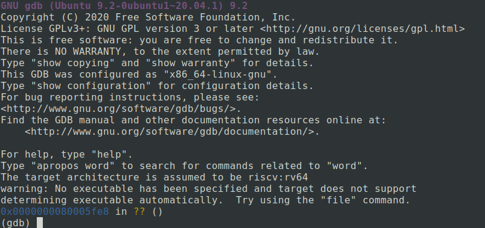
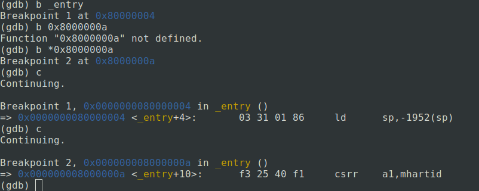
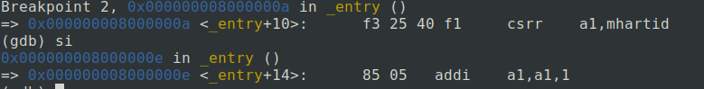

## 参考

[csdn](https://blog.csdn.net/ahundredmile/article/details/125512247)

1. GDB开启qemu调试

在xv6目录下执行 `make CPUS=1 qemu-gdb`:

cpu设为1方便调试，单核或单线程场景下，单个断点可以停止整个程序运行。

```console
$make CPUS=1 qemu-gdb
sed "s/:1234/:26000/" < .gdbinit.tmpl-riscv > .gdbinit
*** Now run 'gdb' in another window.
qemu-system-riscv64 -machine virt -bios none -kernel kernel/kernel -m 128M -smp 1 -nographic -drive file=fs.img,if=none,format=raw,id=x0 -device virtio-blk-device,drive=x0,bus=virtio-mmio-bus.0 -S -gdb tcp::26000
```

需要在新的终端启动gdb

2. 启动GDB

需要工具`gdb-multiarch`

将xv6-labs-2021/.gdbinit文件所在的路径写到～/.gdbinit中
```
add-auto-load-safe-path /home/x/xv6-labs-2021/.gdbinit
```

在lab目录下运行`gdb-multiarch`即可进入qemu调试模式



在程序入口`_entry`设置一个断点，这是qemu跳转的第一个指令。



**Q**：这里断点地址与课程上不一样，为了继续上课，重新在与课程一致的地点打断点。

可以通过查看[kernel.asm](../xv6-labs-2021/kernel/kernel.asm)指定位置的汇编代码，可以看到，在地址0x8000000a读取了控制系统寄存器（Control System Register）mhartid，并将结果加载到了a1寄存器。

地址0x80000000是一个被QEMU认可的地址。也就是说如果你想使用QEMU，那么第一个指令地址必须是它。[kernel.ld](../xv6-labs-2021/kernel/kernel.ld)可以让 bootloader 从该位置加载内核，这也是内核的起始地址。

gdb 会显示指令的二进制代码，可以看到csrr是4字节指令，而 addi 是2字节指令。`si`前进一条汇编指令。



XV6从entry.s开始启动，这个时候没有内存分页，没有隔离性，并且运行在M-mode（machine mode）。XV6会尽可能快的跳转到kernel mode或者说是supervisor mode。我们在main函数设置一个断点，main函数已经运行在supervisor mode了。

运行gdb的layout split模式

```command
layout split
```